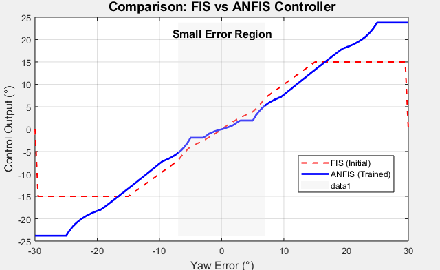

# Legged Robot Yaw Control with ANFIS  

A **data-driven, adaptive control system** for robotic leg yaw positioning, implemented in MATLAB using the **Adaptive Neuro-Fuzzy Inference System (ANFIS)**. This project addresses a critical challenge in legged locomotion: achieving **smooth, stable, and intelligent motion** from an initial yaw angle (e.g., 8°) to a target set point (0°), avoiding abrupt corrections that degrade stability.

Unlike traditional PID or manually tuned FIS controllers, this system **learns optimal control policies from training data**, enabling **human-like adaptation** and **fine-grained correction** near the target.

  
*Control surface comparison: ANFIS learns a smoother, more precise response than manual FIS*

---

This intelligent step-by-step correction enhances stability, reduces overshoot, and creates a more natural movement pattern.

## 📌 Project Overview
This project explores the implementation of **Adaptive Neuro-Fuzzy Inference System (ANFIS)** for smooth yaw control in a **legged robot**.  
The specific case study focuses on transitioning the robot’s yaw angle from **10° to the setpoint 0°** in a smooth, controlled manner — avoiding abrupt changes that could destabilize the robot.

Instead of jumping directly from 10° to 0°, the ANFIS model ensures a gradual transition:

---

## 🧠 Background: FIS & ANFIS

### Fuzzy Inference System (FIS)
A **Fuzzy Inference System** uses fuzzy logic to map inputs to outputs based on predefined rules and membership functions.  
While FIS is effective for control tasks, it relies heavily on manually crafted rules and cannot **learn** from data — making it less adaptive in dynamic or uncertain environments.

### Adaptive Neuro-Fuzzy Inference System (ANFIS)
**ANFIS** combines the interpretability of fuzzy systems with the adaptive learning power of neural networks.  
It automatically adjusts membership functions and rule parameters through training, using real data.  
In this project, ANFIS learns the relationship between **error yaw** (current yaw - setpoint) and the required **control adjustment**.

---

## 🤖 Case Study: Legged Robot Yaw Control

- **Initial yaw position:** `10°`
- **Target yaw position:** `0°`
- **Control method:** ANFIS-trained model
- **Goal:** Achieve smooth, adaptive correction to avoid mechanical stress and instability.

**Why smooth control matters for legged robots:**
- Sudden yaw changes can cause imbalance.
- Gradual corrections improve walking stability.
- Adaptive systems can handle terrain variations better.

---

## 🚀 Why ANFIS over FIS?

| Feature                  | FIS (Traditional)         | ANFIS (Proposed)          |
|--------------------------|---------------------------|---------------------------|
| Rule Creation            | Manual                    | Data-driven               |
| Adaptability             | Low                       | High                      |
| Learning Capability      | None                      | Neural network-based      |
| Output Smoothness        | Moderate                  | High                      |
| Performance over time    | Static                    | Improves with training    |
| Handling Nonlinearity    | Limited                   | Robust                    |

---

## 📊 Performance Highlights

- **Smoother Trajectories:**  
  ANFIS-generated control steps prevent sudden yaw jumps, reducing mechanical stress.

- **Adaptive Learning:**  
  The system automatically fine-tunes itself based on training data, improving performance with more usage.

- **Noise Resilience:**  
  Less sensitive to small sensor noise compared to static rule-based systems.

- **Generalization:**  
  Works not only for yaw control but can be adapted for pitch, roll, or even multi-legged gait synchronization.

---

## 🔮 Potential Improvements
- **Multi-variable ANFIS:** Incorporate pitch and roll for full-body balance control.
- **Hybrid ANFIS + Reinforcement Learning:** Enhance adaptation to unknown terrains.
- **Real-time Training:** Continuous online learning from sensor feedback.

## 🎥 Simulation (Coming Soon)

A dynamic simulation of the robotic leg's yaw motion — showing the smooth transition from 8° to 0° — is currently in development.  
Stay tuned for a **3D visualization or MATLAB animation** demonstrating real-time foot positioning.

👉 *This will include:*
- Foot trajectory (x, y) based on yaw correction
- Step-by-step motion preview
- Comparison: FIS vs ANFIS movement style

---

## 📄 License
This project is licensed under the [MIT License](LICENSE).

## 📬 Contact

**Muchamad Fauzan Atha Artawan**  
📧 muchamadfauzanathaartawan@gmail.com  
🔗 [GitHub](https://github.com/0118200)  
💼 [LinkedIn](https://www.linkedin.com/in/muchamad-fauzan-07621b313/)
